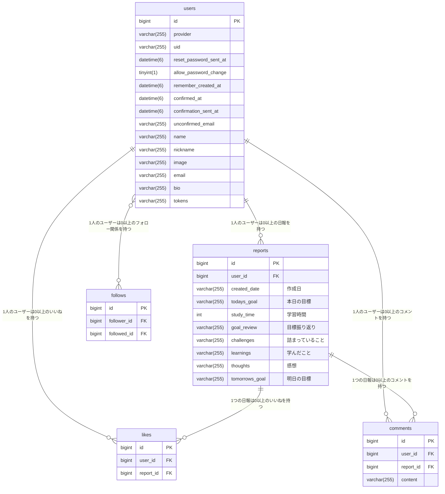
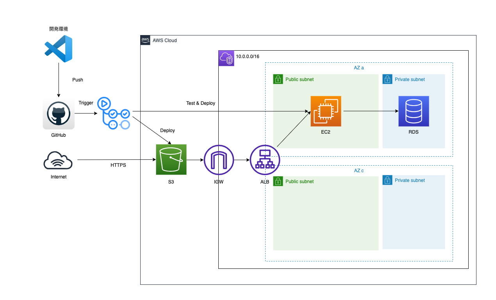

# ProgMinder

## オリジナルプロダクトのURL
[ProgMinder](http://progminder.com "Progminder timeline")

## 画面キャプチャ

### タイムライン(ユーザー全体の学習記録を表示)

### サインイン

### サインアップ

### フォロー(フォロー中のユーザーの学習記録を表示)

### レポート(学習記録を作成)

### ログ(自分の学習記録を表示)

### プロフィール

## 概要
プログラミング学習の記録サービス『ProgMinder』  
手軽にプログラミング学習の記録を作成できるサービスです。  
このサービスにより、以下の課題を解決します：
- 日報作成の方法が分からない
- 日報作成に手間がかかる
- 日報のフォーマットコピペ時の修正ミス

その他に、こちらで日報のフォーマットを提供しているため、他のユーザーと記録を比較しやすいです。
また、他のユーザーの日報を参照できるため、学習のヒントやモチベーション向上に役立ちます。

## 使用技術一覧

### 🖥️ **フロントエンド**
- **Languages & Libraries**: HTML/CSS, TypeScript(4.9.5), React(18.2.0)

### 🚀 **バックエンド**
- **Languages**: Ruby(3.2.2)
- **Framework**: Ruby on Rails(7.0.4.3)
- **Database**: MySQL(8.0.33)

### ☁️ **インフラ**
- **Cloud Services**: AWS (VPC, IGW, ALB, RDS, ACM, Route53, CloudFront, S3, EC2)
- **Server**: Puma

### ✨ **Linter/Formatter**
- RuboCop
- ESLint
- Prettier

### 🧪 **テスト**
- RSpec + FactoryBot

### 🔄 **CI/CD**
- GitHub Actions

### 📦 **バージョン管理**
- Git/GitHub

### 💼 **開発環境**
- **Editor**: Visual Studio Code
- **Containerization**: Docker

# ER図

# インフラ構成図

上記は最終的に目指している構成です。現状とは異なります。

# 機能一覧
- ユーザー新規登録
- サインイン
- サインアウト
- アカウント情報更新
- プロフィールアイコン画像投稿
- アカウント削除
- 日報投稿
- 日報一覧
- 日報編集
- 日報削除
- いいね
- コメント
- フォロー・アンフォロー
- フォロー中のユーザーの日報一覧
- 自分の日報一覧
