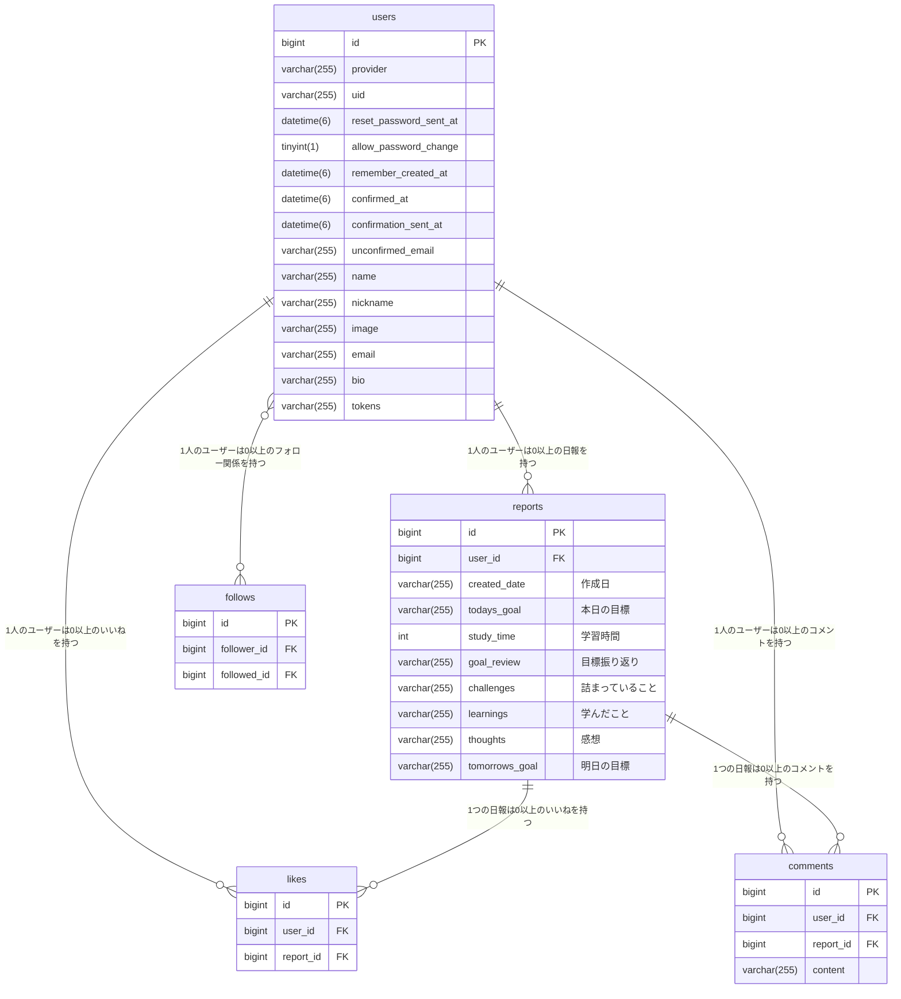

# ProgMinder

# 概要
プログラミング学習の記録サービス『ProgMinder』 手軽にプログラミング学習の記録を作成できるサービスです。
  こちらのサービスはつぎの課題を解決します。
- どうやって日報を作成すればよいのかが分からない
- 日報を作成するのに労力がかかる。
- 日報のフォーマットをコピペで作成していると修正ミスが起こる。

また、他の人の日報が見れるので学習のヒントを得たり、モチベーションアップに繋がります。

# ER図

# 機能一覧
- ユーザー新規登録
- サインイン
- サインアウト
- アカウント情報更新
- プロフィールアイコン画像投稿
- アカウント削除
- 日報投稿
- 日報一覧
- 日報編集
- 日報削除
- いいね
- コメント
- フォロー・アンフォロー
- フォロー中のユーザーの日報一覧
- 自分の日報一覧