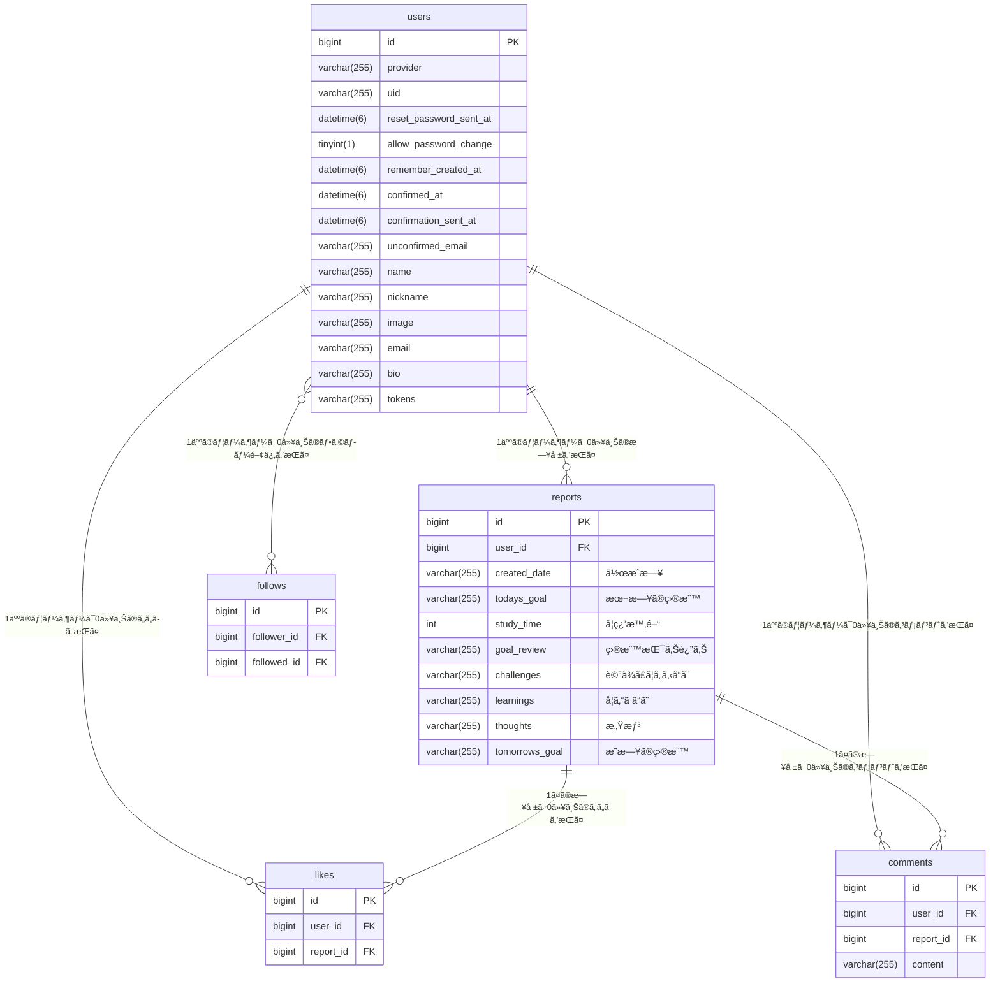

# ProgMinder

## オリジナルプロダクトã®URL
[ProgMinder](http://progminder.com "Progminder timeline")

## 概è¦
プログラミング学習ã®è¨˜éŒ²ã‚µãƒ¼ãƒ“スã€ProgMinder〠 
手軽ã«ãƒ—ログラミング学習ã®è¨˜éŒ²ã‚’作æˆã§ãるサービスã§ã™ã€‚  
ã“ã®ã‚µãƒ¼ãƒ“スã«ã‚ˆã‚Šã€ä»¥ä¸‹ã®èª²é¡Œã‚’解決ã—ã¾ã™ï¼š
- 日報作æˆã®æ–¹æ³•ãŒåˆ†ã‹ã‚‰ãªã„
- 日報作æˆã«æ‰‹é–“ãŒã‹ã‹ã‚‹
- 日報ã®ãƒ•ã‚©ãƒ¼ãƒãƒƒãƒˆã‚³ãƒ”ペ時ã®ä¿®æ­£ãƒŸã‚¹

ãã®ä»–ã«ã€ã“ã¡ã‚‰ã§æ—¥å ±ã®ãƒ•ã‚©ãƒ¼ãƒãƒƒãƒˆã‚’æä¾›ã—ã¦ã„ã‚‹ãŸã‚ã€ä»–ã®ãƒ¦ãƒ¼ã‚¶ãƒ¼ã¨è¨˜éŒ²ã‚’比較ã—ã‚„ã™ã„ã§ã™ã€‚
ã¾ãŸã€ä»–ã®ãƒ¦ãƒ¼ã‚¶ãƒ¼ã®æ—¥å ±ã‚’å‚ç…§ã§ãã‚‹ãŸã‚ã€å­¦ç¿’ã®ãƒ’ントやモãƒãƒ™ãƒ¼ã‚·ãƒ§ãƒ³å‘上ã«å½¹ç«‹ã¡ã¾ã™ã€‚

## 使用技術一覧

### ğŸ–¥ï¸ **フロントエンド**
- **Languages & Libraries**: HTML/CSS, TypeScript(4.9.5), React(18.2.0)

### 🚀 **ãƒãƒƒã‚¯ã‚¨ãƒ³ãƒ‰**
- **Languages**: Ruby(3.2.2)
- **Framework**: Ruby on Rails(7.0.4.3)
- **Database**: MySQL(8.0.33)

### â˜ï¸ **インフラ**
- **Cloud Services**: AWS (VPC, IGW, ALB, RDS, ACM, Route53, CloudFront, S3, EC2)
- **Server**: Puma

### ✨ **Linter/Formatter**
- RuboCop
- ESLint
- Prettier

### 🧪 **テスト**
- RSpec + FactoryBot

### 🔄 **CI/CD**
- GitHub Actions

### 📦 **ãƒãƒ¼ã‚¸ãƒ§ãƒ³ç®¡ç†**
- Git/GitHub

### 💼 **開発環境**
- **Editor**: Visual Studio Code
- **Containerization**: Docker

# ER図

```mermaid
erDiagram
  users ||--o{ reports : "1人ã®ãƒ¦ãƒ¼ã‚¶ãƒ¼ã¯0以上ã®æ—¥å ±ã‚’æŒã¤"
  users ||--o{ likes: "1人ã®ãƒ¦ãƒ¼ã‚¶ãƒ¼ã¯0以上ã®ã„ã„ã­ã‚’æŒã¤"
	users ||--o{ comments: "1人ã®ãƒ¦ãƒ¼ã‚¶ãƒ¼ã¯0以上ã®ã‚³ãƒ¡ãƒ³ãƒˆã‚’æŒã¤"
  reports ||--o{ likes: "1ã¤ã®æ—¥å ±ã¯0以上ã®ã„ã„ã­ã‚’æŒã¤"
  reports ||--o{ comments: "1ã¤ã®æ—¥å ±ã¯0以上ã®ã‚³ãƒ¡ãƒ³ãƒˆã‚’æŒã¤"
	users }o--o{ follows : "1人ã®ãƒ¦ãƒ¼ã‚¶ãƒ¼ã¯0以上ã®ãƒ•ã‚©ãƒ­ãƒ¼é–¢ä¿‚ã‚’æŒã¤"

  users {
    bigint id PK
		varchar(255) provider
		varchar(255) uid
		datetime(6) reset_password_sent_at
		tinyint(1) allow_password_change
		datetime(6) remember_created_at
		datetime(6) confirmed_at
		datetime(6) confirmation_sent_at
		varchar(255) unconfirmed_email
    varchar(255) name
		varchar(255) nickname
		varchar(255) image
		varchar(255) email
		varchar(255) bio
		varchar(255) tokens
  }

  reports {
    bigint id PK
    bigint user_id FK
    varchar(255) created_date "作æˆæ—¥"
    varchar(255) todays_goal "本日ã®ç›®æ¨™"
		int study_time "学習時間"
		varchar(255) goal_review "目標振り返り"
		varchar(255) challenges "è©°ã¾ã£ã¦ã„ã‚‹ã“ã¨"
		varchar(255) learnings "学んã ã“ã¨"
		varchar(255) thoughts "感想"
		varchar(255) tomorrows_goal "æ˜æ—¥ã®ç›®æ¨™"
  }

  likes {
    bigint id PK
    bigint user_id FK
    bigint report_id FK
  }

	comments {
		bigint id PK
		bigint user_id FK
		bigint report_id FK
		varchar(255) content
	}

	follows {
    bigint id PK
    bigint follower_id FK
    bigint followed_id FK
  }
```

# インフラ構æˆå›³

# 機能一覧
- ユーザー新è¦ç™»éŒ²
- サインイン
- サインアウト
- アカウント情報更新
- プロフィールアイコン画åƒæŠ•ç¨¿
- アカウント削除
- 日報投稿
- 日報一覧
- 日報編集
- 日報削除
- ã„ã„ã­
- コメント
- フォロー・アンフォロー
- フォロー中ã®ãƒ¦ãƒ¼ã‚¶ãƒ¼ã®æ—¥å ±ä¸€è¦§
- 自分ã®æ—¥å ±ä¸€è¦§